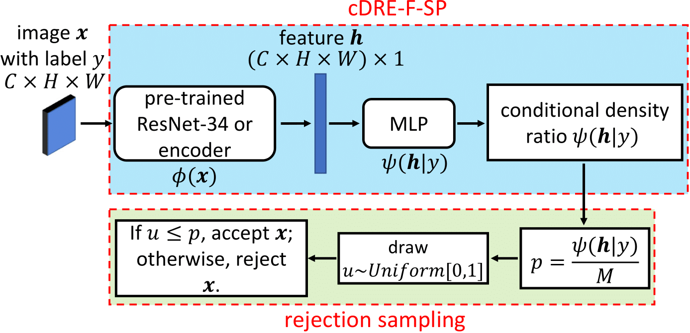
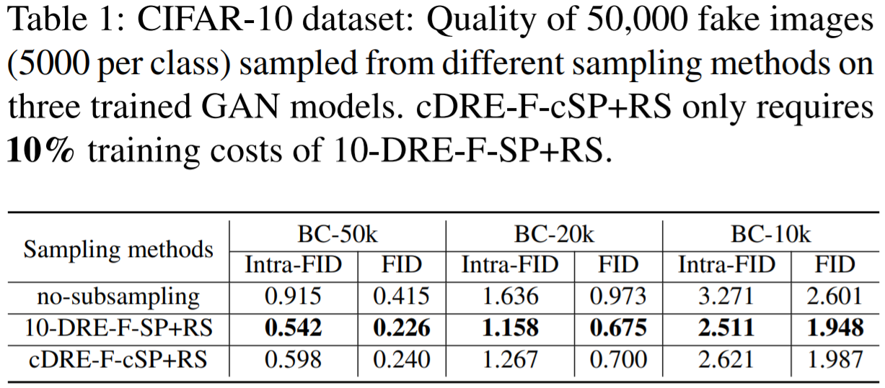
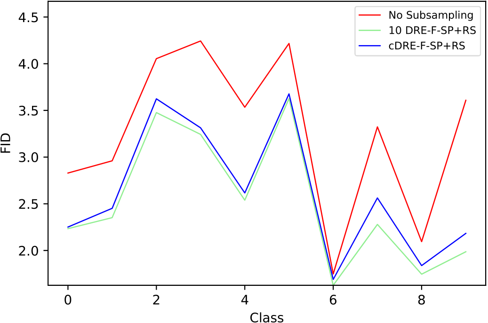
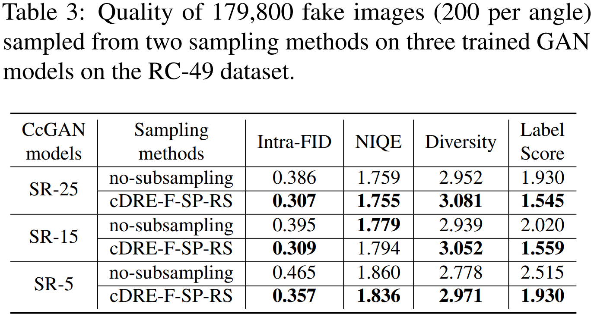
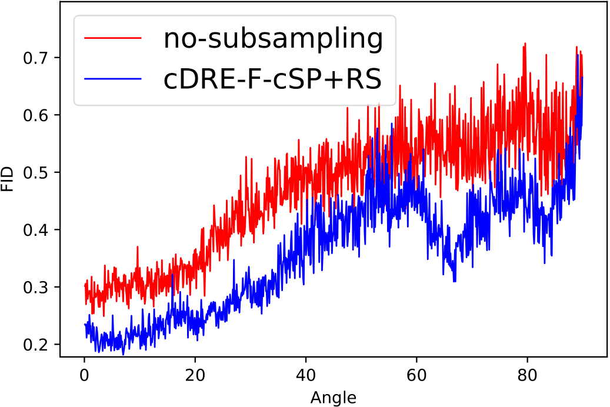
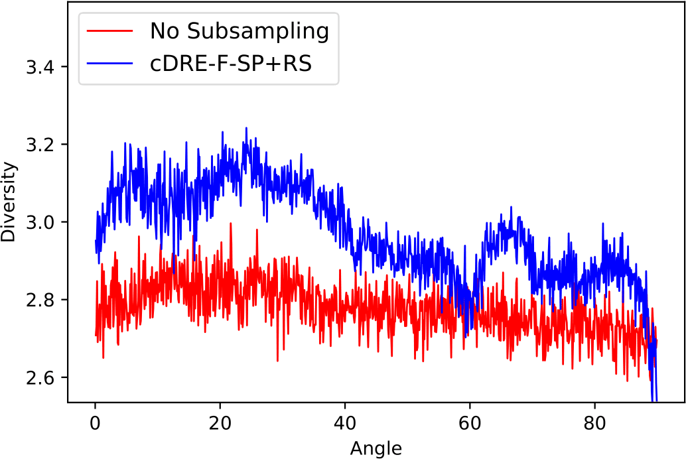
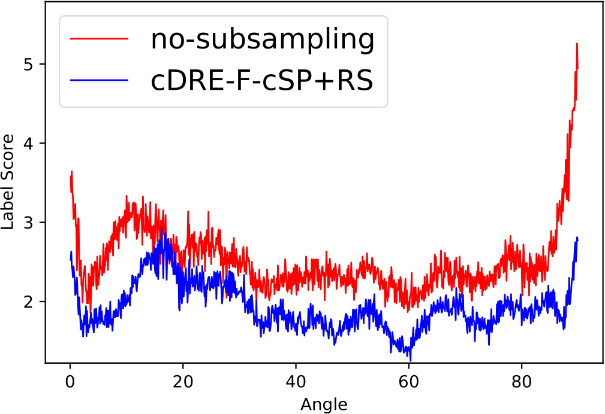

# Generating High-quality Images from Conditional GANs: An Efficient Conditional Subsampling Scheme

This repository provides the source codes for the experiments in our paper on the CIFAR-10 and RC-49 datasets. <br />
If you use this code, please cite
```text

TO BE DONE...

```

<p align="center">
  
  The workflow of cDRE-F-SP+RS.
</p>

-------------------------------

## Datasets (h5 files)

### CIFAR-10 (for the setting with 50000 training samples)
Put the following h5 file at `./CIFAR10/data`: <br />
https://1drv.ms/u/s!Arj2pETbYnWQsdtpYbSbbb7ntilamQ?e=AKaVHF <br />

### CIFAR-10 (for the setting with 20000 training samples)
Put the following h5 file at `./CIFAR10/data`: <br />
https://1drv.ms/u/s!Arj2pETbYnWQsdtqZzH-nTaHSqq-ug?e=svEixn <br />

Put the following h5 file at `./CIFAR10/BigGAN_20K/data`: <br />
https://1drv.ms/u/s!Arj2pETbYnWQsd5yb7DgNhrJAaWZ3A?e=5a5NtL <br />

### CIFAR-10 (for the setting with 10000 training samples)
Put the following h5 file at `./CIFAR10/data`: <br />
https://1drv.ms/u/s!Arj2pETbYnWQsdtr0xfBIgiKANoobA?e=bfFMnQ <br />

Put the following h5 file at `./CIFAR10/BigGAN_10K/data`: <br />
https://1drv.ms/u/s!Arj2pETbYnWQsd44tlt0C_4YLktKcQ?e=ZY9XM8 <br />

### The RC-49 Dataset
Put the following h5 file at `./RC-49/data`: <br />
https://1drv.ms/u/s!Arj2pETbYnWQso1vD_2hHtvbxVOM9w?e=jgK2Se <br />


-------------------------------
## Sample Usage

### CIFAR-10

#### Pre-trained evaluation models and BigGAN
We train an Inception V3 on CIFAR-10 to evaluate the image quality. The checkpoint of the Inception V3 locates at `./CIFAR10/output/eval_models/`. The training codes for BigGAN mainly based on [3] locate at `./CIFAR10/BigGAN_50K`, `./CIFAR10/BigGAN_50K`, and `./CIFAR10/BigGAN_50K`. BigGAN's checkpoints for all three settings are already included in this repository.

#### Fitting the DRE models
Run `./CIFAR10/scripts/run_exp1.sh` for Setting 1 (50,000 samples).  <br />
Run `./CIFAR10/scripts/run_exp2.sh` for Setting 2 (20,000 samples).  <br />
Run `./CIFAR10/scripts/run_exp3.sh` for Setting 3 (10,000 samples).  <br />

The implementation of DRE-F-SP+RS is mainly based on [4].

### RC-49
#### Pre-trained evaluation models
We follow the setups in [1] and [2] to train an AE, a classification-oriented ResNet-34, and a regression-oriented ResNet-34 to evaluate the image quality.  <br />
Put the following checkpoints of evaluation models at `./RC-49/output/eval_models`: <br />
*AE*: https://1drv.ms/u/s!Arj2pETbYnWQso1ekYRSrUaw_J1sHw?e=jLK1sS  <br />
*Classification-oriented ResNet-34*: https://1drv.ms/u/s!Arj2pETbYnWQso1cSXPWcVcLt7B8Lg?e=BHBj3h  <br />
*Regression-oriented ResNet-34*: https://1drv.ms/u/s!Arj2pETbYnWQspR-mZWEeGjKpfkfdA?e=JgRdSR  <br />

#### CcGAN training and DRE fitting
Run `./RC-49/scripts/run_exp1.sh` for Setting 1 (25 images per angle).  <br />
Run `./RC-49/scripts/run_exp2.sh` for Setting 2 (15 images per angle).  <br />
Run `./RC-49/scripts/run_exp3.sh` for Setting 3 (5 images per angle).  <br />

Note that for the CcGAN training, we implement **SVDL+ILI** with training setups (e.g., kappa, epochs, batch size, learning rate) in [2]. <br />

#### Evaluation
Intra-FID, Diversity, and Label Score will be computed by running the above `.sh` files. <br />

To compute NIQE, run the following `.sh` files to dump fake images to `./RC-49/output/main_NImgPerLabel_XX/eval_results/dump_fake_data_for_NIQE`:  <br />
Run `./RC-49/scripts/run_dump_img_for_niqe_1.sh` for Setting 1 (25 images per angle).  <br />
Run `./RC-49/scripts/run_dump_img_for_niqe_2.sh` for Setting 2 (15 images per angle).  <br />
Run `./RC-49/scripts/run_dump_img_for_niqe_3.sh` for Setting 3 (5 images per angle).  <br />

Rename the folder containing fake images to `fake_images` and then compress `fake_images` with a filename `fake_images.zip`. Move `fake_images.zip` to `./RC-49/NIQE/fake_data`. Then, run `./RC-49/NIQE/run_test.sh`. <br />


-------------------------------
## Some Results
⋅⋅* CIFAR-10
<p align="center">
  
  
</p>

⋅⋅* RC-49
<p align="center">
  
  
  
  
</p>


-------------------------------
## References
[1] X. Ding, Y. Wang, Z. Xu, W. J. Welch, and Z. J. Wang, “CcGAN: Continuous conditional generative adversarial networks for image generation,” in International Conference on Learning Representations, 2021.  <br />
[2] X. Ding, Y. Wang, Z. Xu, W. J. Welch, and Z. J. Wang, “Continuous conditional generative adversarial networks for image generation: Novel losses and label input mechanisms,” arXiv preprint arXiv:2011.07466, 2020. https://github.com/UBCDingXin/improved_CcGAN  <br />
[3] https://github.com/ajbrock/BigGAN-PyTorch <br />
[4] Ding, Xin, Z. Jane Wang, and William J. Welch. "Subsampling generative adversarial networks: Density ratio estimation in feature space with softplus loss." IEEE Transactions on Signal Processing 68 (2020): 1910-1922. https://github.com/UBCDingXin/DDRE_Sampling_GANs
